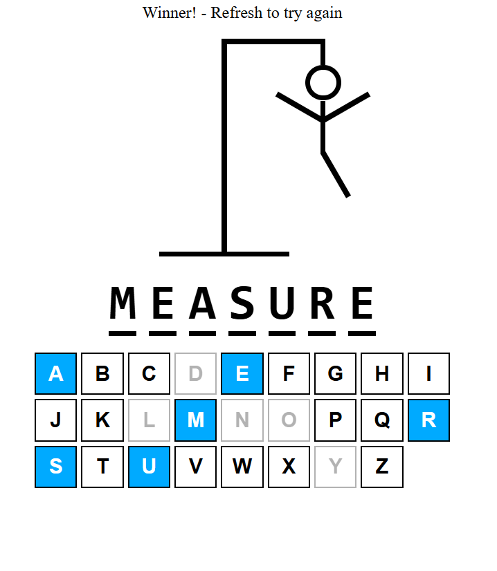
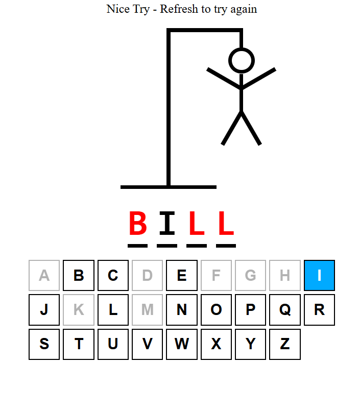

# 🕹️ Hangman Game - React + TypeScript + Vite

A simple and interactive Hangman game built with **React**, **TypeScript**, and powered by **Vite** for fast development and lightning-quick reloads.

## 🚀 Features

- Built with React and TypeScript
- Fully typed for better development experience
- Responsive layout
- Random word selection
- Keyboard input with visual feedback
- Clean and minimal UI
- Fast Vite-powered development server

## 🖼️ Screenshots

<p align="center">
  
  
</p>

## 📦 Installation

Clone the repository and install dependencies:

```bash
git clone git@github.com:ArchitKayal/HangMan.git
cd HangMan
npm install